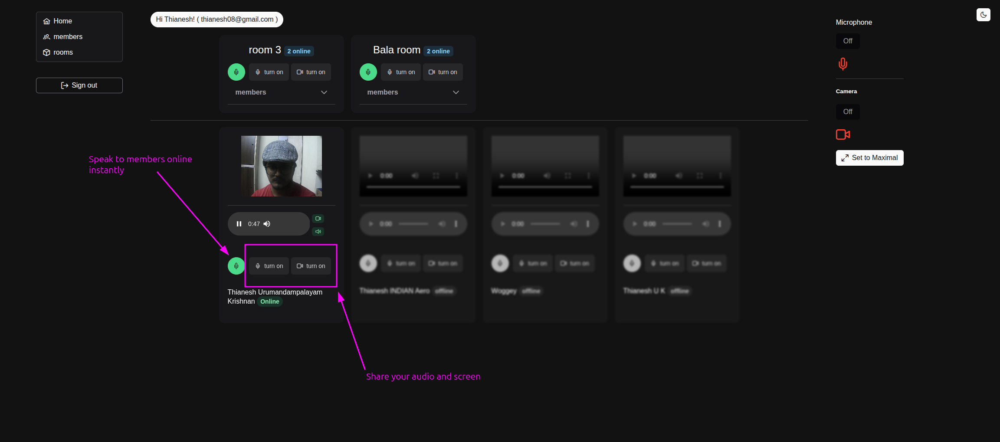
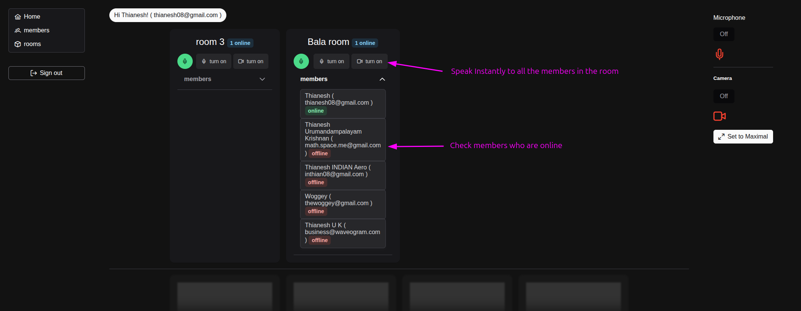
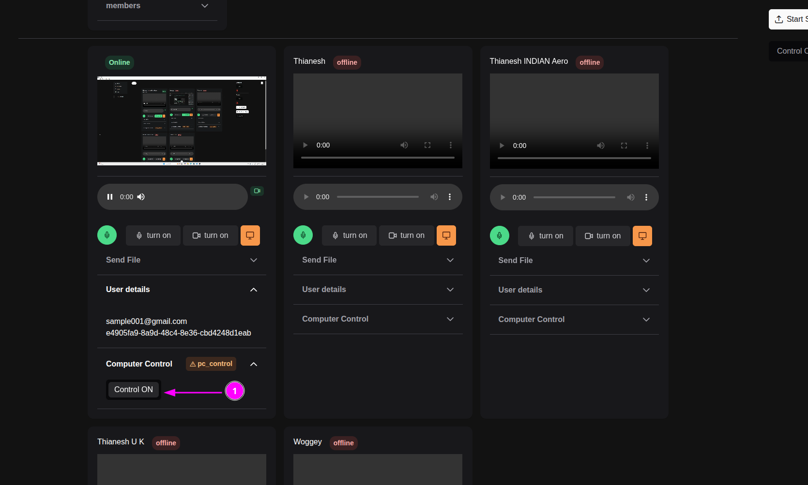
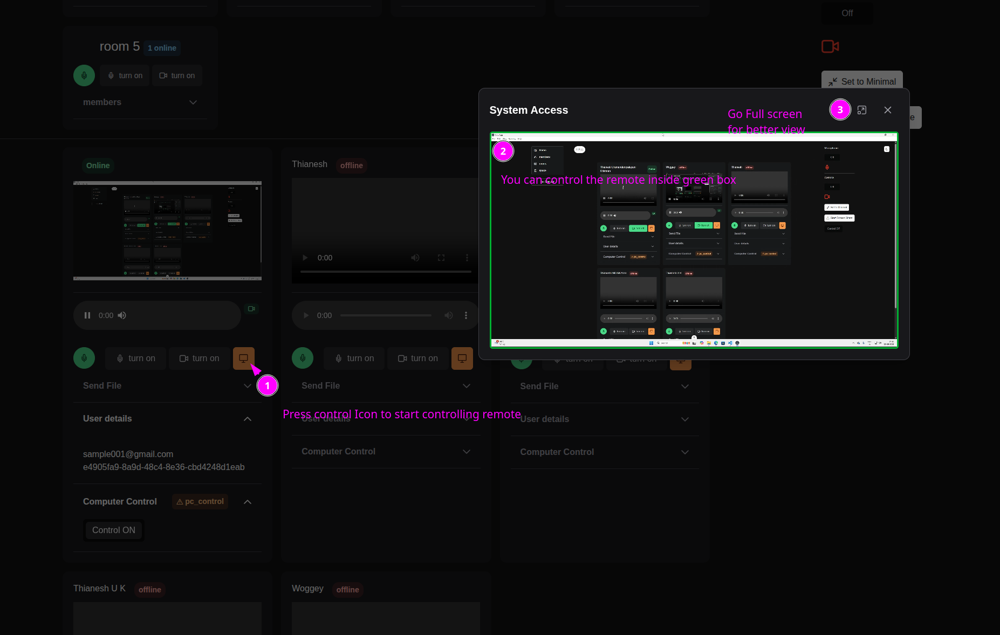

# Golang Agent Server with Tools
An end-to-end real-time media engine for an AI agent framework powered by Go.

## 📦 Current Progress
The media engine has been completed with Google meet like features and more. As of 17-June-2025:

## with system control features like Team viewer or Anydesk
Allow the user to control.

from the other PC

